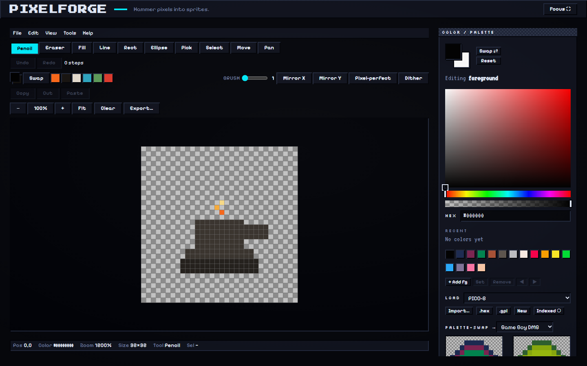
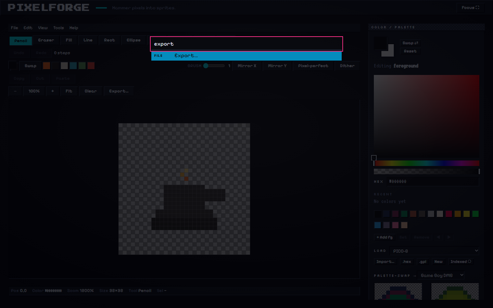
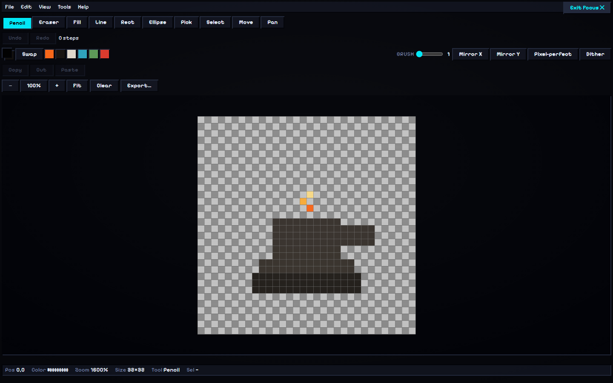

<div align="center">

# 🔨 PixelForge

### Hammer pixels into sprites.

A fast, fully **client-side** retro pixel-art editor for the browser. Draw in pixels,
work in layers and animation frames, and export to **PNG · SVG · GIF · spritesheet** —
all under a bespoke **Arcade-CRT** aesthetic. No accounts, no server, works **offline**.

[](https://github.com/BataJini/pixel-forge/actions/workflows/ci.yml)
[](https://batajini.github.io/pixel-forge/)
[](LICENSE)


### [▶ Try it live](https://batajini.github.io/pixel-forge/)



</div>

---

## Features

🎨 **Full drawing toolkit** — pencil, eraser, flood-fill, line, rectangle, ellipse,
eyedropper, rectangular select, move, and pan. Adjustable brush size, X/Y mirror,
pixel-perfect strokes, and dithering.

🗂️ **Layers** — add, duplicate, delete, rename, reorder, lock, opacity, merge-down,
and flatten, over a live composite preview.

🎞️ **Animation** — a frame timeline with per-frame duration, FPS, onion-skin ghosting,
and play / pause / loop / ping-pong playback.

🌈 **Color & palettes** — free RGBA color with an HSV picker, foreground/background
swap, classic hardware palettes (NES, Game Boy, PICO-8…), `.hex` / `.gpl` import, and
an indexed *palette-lock* mode with live palette-swap.

↩️ **History** — memory-efficient dirty-rectangle undo/redo; a whole drag is one step.

💾 **Export & save** — PNG at integer nearest-neighbor scale, crisp SVG, animated GIF
(encoded in a Web Worker), spritesheet PNG **+ JSON atlas**, and a lossless `.forge`
project file. In-browser gallery via IndexedDB; import existing images.

⌨️ **App shell** — File/Edit/View/Tools/Help menu bar, a **`Ctrl/⌘+K` fuzzy command
palette**, a full keyboard-shortcut set, a **Focus / fullscreen** mode (`F`), and a
`?` shortcut cheatsheet.

♿ **Accessible & offline** — zero serious/critical **WCAG 2.1 AA** violations (axe),
fully keyboard-operable, honors `prefers-reduced-motion`, and installs as a **PWA**
that boots offline with **no third-party requests**.

> The signature **CRT scanline/glow is a display-only overlay** — it never touches the
> pixel buffer, so every export is clean, effect-free artwork.

<div align="center">


</div>

## Tech stack

| Concern | Choice |
| --- | --- |
| Build / dev server | **Vite 7** |
| UI | **React 19** + **TypeScript 5.9** (strict) |
| State | **Zustand** + raw typed-array pixel buffers |
| Rendering | Hand-rolled **Canvas 2D** three-layer pipeline (nearest-neighbor, dirty-rect) |
| GIF | **gifenc** in a Web Worker |
| Lint & format | **Biome 2** (one tool, no ESLint/Prettier) |
| Tests | **Vitest 4** (unit) · **Playwright** (E2E) · **axe-core** (a11y) |
| PWA | **vite-plugin-pwa** (Workbox precache) |
| Deploy | **GitHub Pages** / **Cloudflare Pages** |

## Architecture

Organized by responsibility, with a hard boundary between the pure engine and the browser:

```
src/
├── core/      Pure, deterministic engine — buffers, tools, layers, history,
│              frames, palettes, exporters. No React / DOM / browser globals.
├── state/     Application state stores (Zustand).
├── ui/        React components — canvas stage, panels, dialogs, app shell.
├── platform/  Browser glue — Canvas, File System Access, IndexedDB, workers.
└── styles/    Design tokens (CSS variables) — the single source of visual truth.
```

Because `src/core` is DOM-free, the entire drawing engine is unit-testable in plain
Node — which is exactly how the held-out acceptance suites in `tests/acceptance/`
verify it.

## Getting started

```bash
git clone https://github.com/BataJini/pixel-forge
cd pixel-forge
npm ci

npm run dev        # http://localhost:5173/pixel-forge/
```

Build & preview a production bundle:

```bash
npm run build
npm run preview    # http://localhost:4173/pixel-forge/
```

## Testing & quality

```bash
npm test           # Vitest — unit + protected held-out acceptance suites
npm run test:e2e   # Playwright — app-shell, keyboard, a11y (axe), offline PWA
npm run lint       # Biome
npm run typecheck  # tsc
```

- **643** unit / acceptance tests · **31** end-to-end tests
- Production JS ≈ **115 KB gzipped** (budget < 250 KB)
- **axe** reports zero serious/critical WCAG 2.1 AA violations

## Keyboard shortcuts

| | | | |
|---|---|---|---|
| `B` pencil | `E` eraser | `G` fill | `L` line |
| `U` rect/ellipse | `I` eyedropper | `M` select | `V` move |
| `H` / `Space` pan | `X` swap colors | `[` `]` brush size | `+` `−` zoom |
| `Ctrl+Z` undo | `Ctrl+Shift+Z` redo | `Ctrl+K` command palette | `F` focus mode |

## How it was built

PixelForge was built as an experiment in **autonomous, verification-gated development**:
a multi-agent harness expanded a one-line idea into an exhaustive spec and a bespoke
design, then ran a continuous **build → adversarial review → QA → independent verify →
document** loop, unit by unit, with protected held-out tests the builder couldn't edit.
The design direction (`docs/design-direction.md`) and full specification
(`docs/master-spec.md`) were authored up front and are included here.

## License

[MIT](LICENSE) © [BataJini](https://github.com/BataJini)
